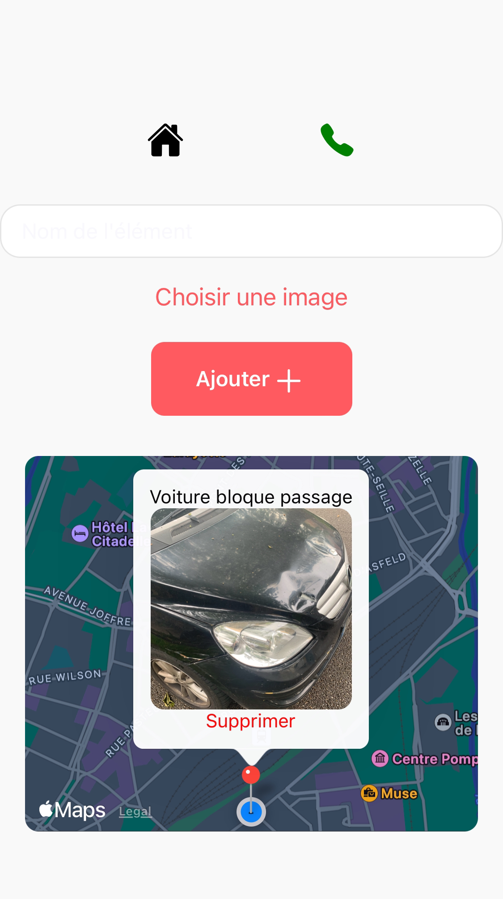
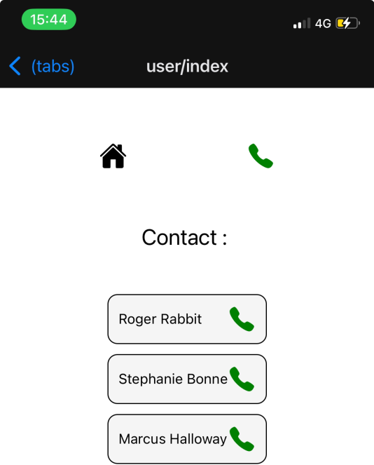

# Bienvenue sur mns_app 🗺

Ce projet est une application développé 
en React Native a des fins d'apprentissage.

## Commencer

1. Installer les dépendances

   ```bash
   npm install
   ```

2. Démarrer l'application

   ```bash
    npx expo start
   ```

Il faudra au préalable l'application Expo Go pour tester
ou un émulateur.

## Quelques Screens

### La home :


### Les contacts



By Noé Ziadi
